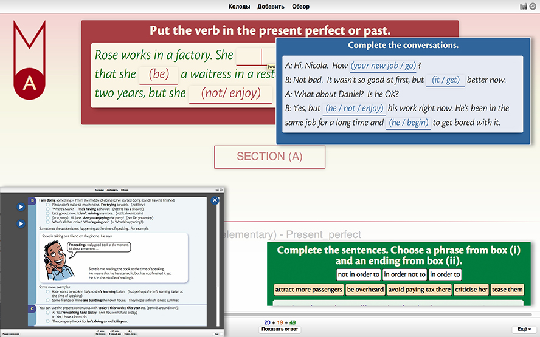
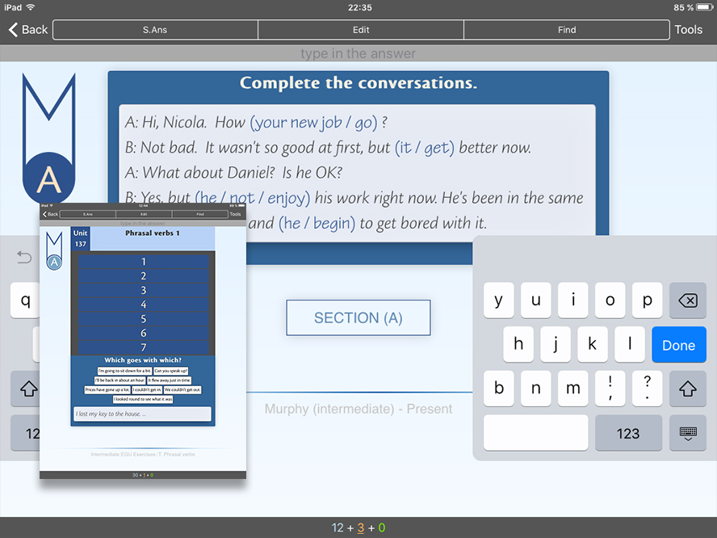
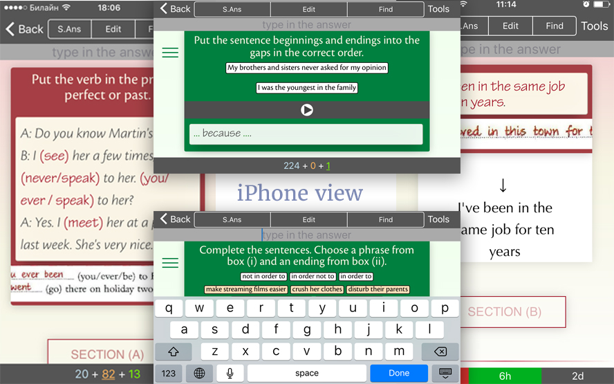
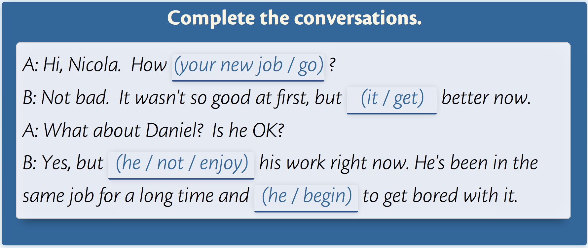
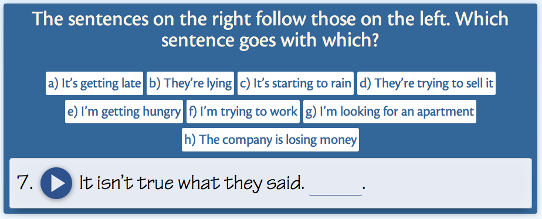
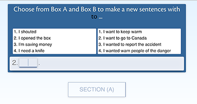

# Anki Theme 
## Learning English grammar with Anki: Themes for Raymond Murphy’s system books and not only.
- [Some necessary operations](#some-necessary-operations-for-this-template)
- [Optional recommended](#optional-recommended)
- [Card Fields](#card-fields)
- [Notes](#notes)

This Anki theme will help make your English decks a little more effectively. [Janki method](https://apps.ankiweb.net/docs/manual.html#spaced-repetition), spaced repetition software is a helpful learning tool for English grammar from beginner to experienced.

The template is built in html, javascript and css. Include fields: audio, transcriptions.

#### Some notes from official site.
> ##### [Self-made versus pre-made](https://apps.ankiweb.net/docs/manual.html#downloading-shared-decks)
Creating your own deck is the most effective way to learn a complex subject. Subjects like languages and the sciences can’t be understood simply by memorizing facts — they require explanation and context to learn effectively. Furthermore, inputting the information yourself forces you to decide what the key points are, leading to a better understanding.

 > Do not learn if you do not understand.
—[SuperMemo](https://www.supermemo.com/en/articles/20rules)

### Notes
>Each Anki client and each Anki version may implement card display differently, so you will need to test the behaviour across platforms. 
Currently was tested only Mac clients (desctop and iPad). But was made responsive layout for iPhones versions. 
Also was tested on the Windows 10 (desctop) last version Anki.

## Card Types
There are currently one type of card. 
 **[Cloze]**
  - Freeform show/hide, question/answer, audio/subtitles fields.  

#### some necessary operations for this template:
>- Anki doesn’t import fonts, so you need install these fonts **to your OS**: 
_CronosPro-Bold.ttf 
_CronosPro-Lt.ttf 
_CronosPro-LtIt.ttf 
_CronosPro-Regular.ttf 
_CronosPro-Semibold.ttf 
_TektonPro-Regular.ttf 
This fonts were taken from original source for best fitness. And some layouts were made for them. So it’s recommended.
For instaling in a folder `Reference files/fonts`
- On mobile version it is necessary switch off tap zones.
- Instal a plug-in: [Replay buttons on card](https://ankiweb.net/shared/info/498789867) for sound fields.

### Optional recommended
- For convenient filling of forms instal a plug-in: [Power Format Pack: Markdown, code blocks, lists, tables, syntax highlight & more](https://ankiweb.net/shared/info/162313389)
- [Additional Card Fields](https://ankiweb.net/shared/info/441235634) for distinction by color text of question: 
new card = blue 
studied card = maroon 
Repeated card = green 
`.q0 { color: blue; }` 
`.q1 { color: maroon; }` 
`.q2 { color: darkgreen; }` 

## Card Fields
Fields marked **Optional** fields (♟ ♻ ✎ ♫ ♨) can be left blank and the template will ignore them. **Required** fields (✔) are required in order for a card to be generated.
### ✔ID: 
Required
> **example** - “3.4.9” = (3-unit); (4-exercise); (9-question).

### ✔№ Unit:
Required / optional (hiding field by button)

>**example** - “Unit 3”.

### ✔ Unit Name:
Required (hiding field by button)
>**example** - _“Present continuous and present simple 1
(I am doing and I do)”_.

### ✔♞Exercise:
Required
>**example** - “Complete the conversations.”.

### ✔☛ Question:
Required
>**example** -  
“A: Hi, Nicola. How `{{c1::'s your new job going::(your new job / go)}}`?  
B: Not bad. It wasn't so good at first, but `{{c1::it's getting::(it / get)}}` better now.  
A: What about Daniel? Is he OK?  
B: Yes, but `{{c1::he isn't enjoying / he's not enjoying::(he / not / enjoy)}}` his work right now. He's been in the same job for a long time and `{{c1::he's beginning / he is beginning::(he / begin)}}` to get bored with it.”
>  
To choose typing area press tab - once or twice.

>When you start typing in field the cursive example disappear. But it can be displayed by hover on the input field.

> 
This field is button also. By the tap on this field `♟ Example` field opens

> 
You can add sound into this field: `7. [sound:rec1491131723.mp3] It isn’t true what they said. {{c1::They’re lying / (b}}`.

### ♫ Answer
Optional (on the back side of card)
>recommended use [AwesomeTTS text-to-speech add-on](https://ankiweb.net/shared/info/301952613) for this field.
>  
> 
### ✎ Choices 
Optional
> **example 1** - 
“start; get;  increase;  change; rise”

>  
use **“;”** for words split.

> **example 2**  
> “not in order to;in order not to;in order to | attract more passengers;be overheard;avoid paying tax there;criticise her;tease them”

>  
and use **“|”** for differentiation of groups words.

### ✎ Add Words 1 box and ✎ Add Words 2 box
Optional
> **example** - 

>  
edit

>  
_Or one box only_

>  
_the second field is empty_

> And for anything but use sparingly, as it's always best to be succinct with Anki. Think of this as a 'reference' for future use:

> - Links to documentation
- Supplementary notes
- Anything that is universal between cards

### ♫ Question
Optional
> Sound for question if it necessary. In this case use `♟ Example` field for subtitles.

> 
back side view

### ♟ Example
Optional (hiding field by button)
> image or text

>  
example of screenshot

>  
on the card

### »»♻«« Image for Question
Optional
> Use it for image.

### ♨ Hint Front
Optional (hiding field by button) 
as idea this field for the theory
> If this field for image use - recommended width:  ~ 1000px;  
by example I paste “A”section’s screenshot from original book.

>  
example of screenshot

### ♫ Hint Front
Optional (hiding field by button)
>Sound for content of `♨ Hint Front` field. 
! If them several then - by a new row each sound.

! 

### ♨ Hint Back
Optional  
(hiding field by button for back side card) 
as idea this field for the theory
> If this field for image use - recommended width:  ~ 1000px;  
by example I paste “B C D”sections’s screenshot from original book.

>   
example of screenshot

### ♫ Hint Back
Optional  
(hiding field by button for back side of card)
> Sound for content of `♨ Hint Back` field. 
! If them several then - by a new row each sound.

> 

