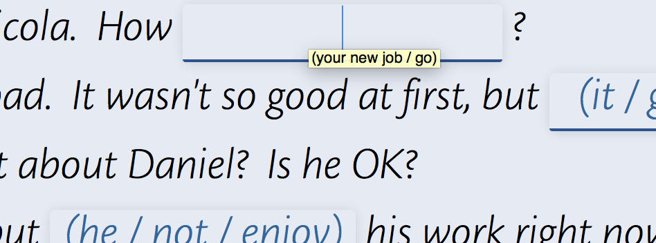
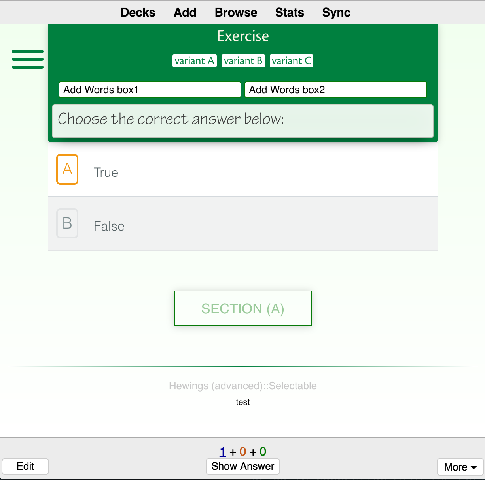
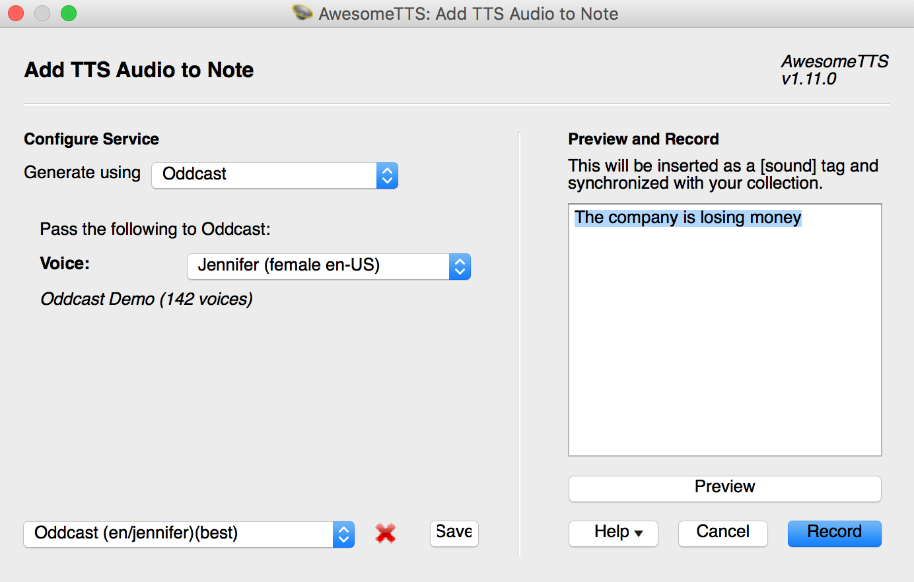
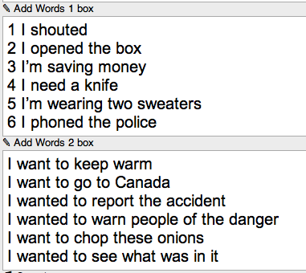
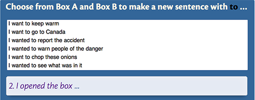
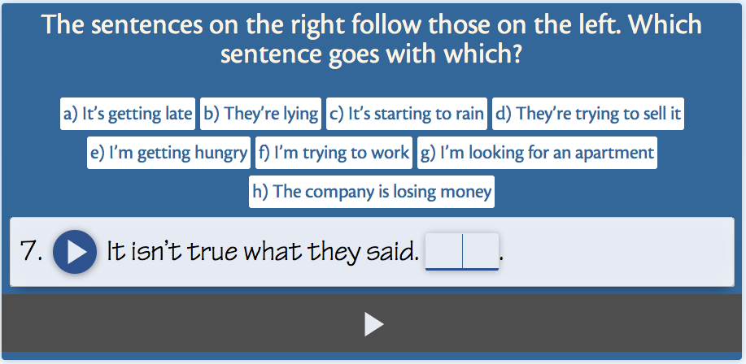
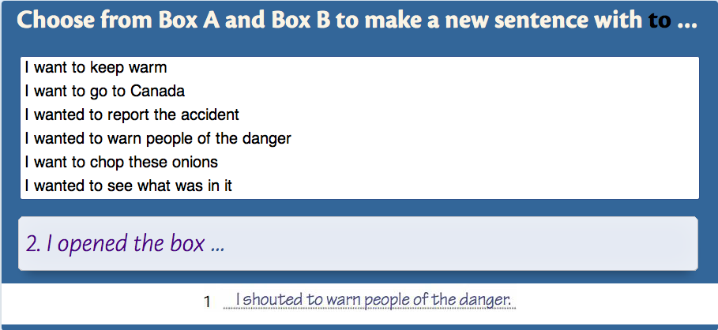
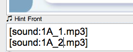
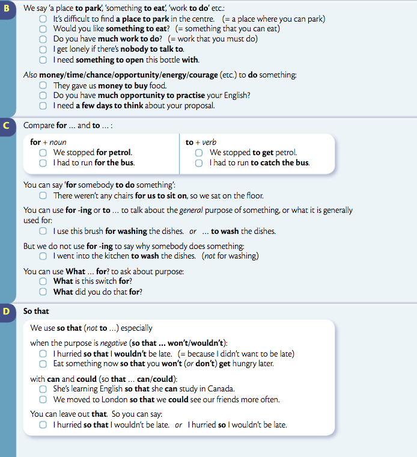
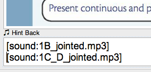

# Anki Theme 
Изучайте Английскую грамматику с Anki: Шаблоны для книг по системе Murphy и не только.


=================

  * [Некоторые записи с официального сайта.](#Некоторые-записи-с-официального-сайта)
  * [Notes](#notes)
  * [Тип Карты](#Тип-Карты)
     * [Опциональные рекомендации](#Опциональные-рекомендации)
  * [Card Fields](#card-fields)
     * [✔ID:](#id)
     * [№ Unit:](#-unit)
     * [✔ Unit Name:](#-unit-name)
     * [✔♞Exercise:](#exercise)
     * [✔☛ Question:](#-question)
     * [★ Selectable choices (отдельный тип записи)](#-selectable-choices-отдельный-тип-записи)
     * [♫ Answer](#-answer)
     * [✎ Choices](#-choices)
     * [✎ Add Words 1 box and ✎ Add Words 2 box](#-add-words-1-box-and--add-words-2-box)
     * [♫ Question](#-question-1)
     * [♟ Example](#-example)
     * [»»♻«« Image for Question](#-image-for-question)
     * [♨ Hint Front Image (XXL)](#-hint-front-image-xxl)
     * [♨ Hint Front Text](#-hint-front-text)
     * [♫ Hint Front](#-hint-front)
     * [♨ Hint Back](#-hint-back)
     * [♫ Hint Back](#-hint-back-1)
     * [♨ Hint Back Text](#-hint-back-text)
 * [Техническая заметка](#Техническая-заметка)
 * [Donates](#donates)

Эти шаблоны для Anki сделают ваши колоды по Англйской грамматике немного более эффективными. [Anki метод](https://apps.ankiweb.net/docs/manual.html#spaced-repetition), spaced repetition software is a helpful learning tool for English grammar from beginner to experienced.

Шаблон сделан на html, javascript and css. Включает поля: звука, транскрипции. На десктопной версии реализовано вписывание пропусков непосредственно в предложение. В iOs версиях множественные пропуски необходимо вписывать через запятую.


#### Некоторые записи с официального сайта.
> [Самостоятельно изготовленные колоды лучше полученных готовыми](http://finpapa.ucoz.ru/ankitest-manual.html#adding-material)
Создание ваших собственных колод карточек является наиболее эффективным путём для заучивания сложного предмета.
>>Для результативного освоения иностранных языков или точных наук недостаточно простого запоминания — требуется всему находить своё объяснение и свой контекст. Более того, самостоятельный ввод информации позволяет вам найти в ней ключевые моменты, ведущие к лучшему пониманию происходящего.

 > Do not learn if you do not understand.
—[SuperMemo](https://www.supermemo.com/en/articles/20rules)

<br>
В данном шаблоне максимально сохранен алгоритм осовения грамматики представленный в огригинале. Что заключается в следующем сценарии:

- Перед вами Упражнение и вопрос
- Если вы затрудняетесь ответить - нажатием на вопрос открывается пример аналогичного вопроса.
- Если необходима дополнительная информация вы отрывается секцию Appendix (7 шт)
- Если нужна дополнительная информаци вы открываете секцию теории “А”
Если ответ не верен или вы не понимаете почему он верен, на обратной стороне катрочки вы можете ознакомится с секциями теории “B, C, D e t.c” по аналогии с учебником где на левой стороне теория, а на правой стороне практика. 

Данный шаблон позволяет создавать вам собственные сценарии обучения. 

### Notes
> - Каждая версия программы Anki может реализовывать показ карточек различным образом (особенно на разных платформах), поэтому вы должны каждый раз тщательно тестировать поведение карточек в различной среде. 
<br>
**Тем не менее**: <br>
На данный момент было протестировано только Mac clients (desctop and iPad) и Windows. Была сделана адаптивная верстка для iPhone версий.
- Автоматизировать занесение данных из книг (PDF), технически не представляется возможным. Во всяком случае, в том виде под который создавался шаблон. Универсального метода автоматизировать занесение данных, для любой книги по грамматике, не получится. А шаблон задумывался как универсальное решение и не ограничивается только лишь книгами Murphy.
- При определенной практике (используйте хот кеи (shift+command+C и shift+alt+command+C для скрытия слов), ставьте галку на полях “Помнить последние введенные данные”) заполнение карточек из одного юнита не должно занимать более 10-15 минут, без учета времени на изучение.

## Тип Карты
тип карты<br>
 **[Cloze]**
  - Freeform show/hide, question/answer, audio/subtitles fields.<br><br>

####Некоторые необходимые действия для установки шаблона:
>- Анки не импортирует шрифты, так что небходимо установить шрифты вручную на вашу операционку:<br>
_CronosPro-Bold.ttf<br>
_CronosPro-Lt.ttf<br>
_CronosPro-LtIt.ttf<br>
_CronosPro-Regular.ttf<br>
_CronosPro-Semibold.ttf<br>
_TektonPro-Regular.ttf<br>
Эти шрифты были взяты из оригинальных источников издателей. И некоторая верстка была сделана под них. Так что это рекомендуется установить.<br>
Файлы для установки находятся в `Reference files/fonts`
- На мобильной версии необходимо отключить тап зоны.
- Установите плагин: [Replay buttons on card](https://ankiweb.net/shared/info/498789867) для звуковых вставок.

### Опциональные рекомендации
- Для удобства заполнения форм установите плагин: [Power Format Pack: Markdown, code blocks, lists, tables, syntax highlight & more](https://ankiweb.net/shared/info/162313389)
- [Additional Card Fields](https://ankiweb.net/shared/info/441235634) для разделение карточек по цвету текста вопроса:<br>
новая карта = blue<br>
на изучении = maroon<br>
повторяемая = green<br>
`.q0 { color: blue; }`<br>
`.q1 { color: maroon; }`<br>
`.q2 { color: darkgreen; }`<br>

## Card Fields
Поля помеченные **Optional** (♟ ♻ ✎ ♫ ♨) могут быть оставлены пустыми и шаблон проигнорирует их. **Required** поля (✔) необходимы для того, чтобы карта сгенерировалась.
### ✔ID: 
Required
> **example** - “3.4.9” = (3-unit); (4-exercise); (9-question).

### № Unit:
Required / optional (скрытое поле под кнопкой)

> **example** - “Unit 3”.

### ✔ Unit Name:
Required (скрытое поле под кнопкой)
>**example** - _“Present continuous and present simple 1
(I am doing and I do)”_.

### ✔♞Exercise:
Required
>**example** - “Complete the conversations.”.

### ✔☛ Question:
Required
> **example** -<br>
“A: Hi, Nicola. How `{{c1::'s your new job going::(your new job / go)}}`? <br>
B: Not bad. It wasn't so good at first, but `{{c1::it's getting::(it / get)}}` better now. <br>
A: What about Daniel? Is he OK? <br>
B: Yes, but `{{c1::he isn't enjoying / he's not enjoying::(he / not / enjoy)}}` his work right now. He's been in the same job for a long time and `{{c1::he's beginning / he is beginning::(he / begin)}}` to get bored with it.”

> <br>
Чтобы выбрать область ввода текста нажмите TAB - один или два раза.

> Когда вы начинаете печатать поле с курсивным примером исчезает. Но это может быть показано при нависании указателя мыши над полем.

> 
 On the card <br>
> 
Так же, можно добавить звук в это поле: `7. [sound:rec1491131723.mp3] It isn’t true what they said. {{c1::They’re lying / (b}}.`

###	★ Selectable choices (отдельный тип записи)
**(доступно только для типа карт [base])**

Optional

- Выберите из предлагаемых ответов.
- Правильные ответы могут быть один, два или все.
- если количество выбранных полей больше или меньше, чем правильных - любой ответ не защитан.
- заполнение этого поля должно соответствовать (разделение вариантов через символ "|"): `variant-1 | <i>variant-2</i> | variant-3`

	

### ♫ Answer
Optional (для обратной стороны карточки)
>recommended use [AwesomeTTS text-to-speech add-on](https://ankiweb.net/shared/info/301952613) for this field.

><br>
window of editing


><br>
back side view

### ✎ Choices 
Optional
> **example 1** -<br>
“start; get;  increase;  change; rise”


> <br>
use **“;”** для разделения слов.


> **example 2** <br>
> “not in order to;in order not to;in order to | attract more passengers;be overheard;avoid paying tax there;criticise her;tease them”

> <br>
and use **“|”** для разделения группы слов.

### ✎ Add Words 1 box and ✎ Add Words 2 box
Optional
> **example** -<br>

> <br>
edit

> <br>
_Or one box only_

> <br>
_the second field is empty_

> И для чего угодно еще. Но используйте эти поля экономно, поскольку всегда лучше быть кратким в изучении по методу Anki. Думайте об этих полях как о ссылке для будущего использования:

> - Ссылки к документациям
- Дополнительные примечания
- Что-либо, что универсально между картами

### ♫ Question
Optional
>Звук для вопроса, если это необходимо. В этом случае используйте `♟ Example` поле для субтитров.
> 


### ♟ Example
Optional (скрытое поле под кнопкой)
>image or text

> <br>
example of screenshot

> <br>
on the card

### »»♻«« Image for Question
Optional
>Use it for image.

### ♨ Hint Front Image (XXL)
optional (скрытое поле под кнопкой)<br>
> Если это поле используется для скриншота (изображения) - рекомендованная ширина скриншота:  ~ 1000px

> <br>
example of screenshot

### ♨ Hint Front Text
optional (скрытое поле под кнопкой)<br>
> Используется для вставки текста (html, таблицы, цитаты, список и т.д.)

### ♫ Hint Front
Optional (скрытое поле под кнопкой)
> Звук для теории `♨ Hint Front` field.<br>
! Если записей несколько - заполняйти каждую запись с новой строки.



### ♨ Hint Back
Optional <br>
(скрытое поле под кнопкой для оборотной стороны карты)<br>
> Если это поле используется для скриншота (изображения) - рекомендованная ширина:  ~ 1000px;  
by example I paste “B C D”sections’s screenshot from original book.

><br>
example of screenshot

### ♫ Hint Back
Optional <br>
(скрытое поле под кнопкой для оборотной стороны карты)
> Звук для теории `♨ Hint Back` поле.<br>
! Если записей несколько - заполняйти каждую запись с новой строки.

> 

### ♨ Hint Back Text
optional (скрытое поле под кнопкой)<br>
> Используется для вставки текста (html, таблицы, цитаты, список и т.д.)

### Техническая заметка!
Есть небольшое, но заметное различие в отображении высоты выравнивания текста по сравнению с Anki 2.0 и Anki 2.1
Для корректного отображения кнопок в Anki 2.0 в режиме "edit" в поле "Styling" в самом конце вставьте следующий код: 

```CSS 
.win #overlay_title #p_button,
.mac #overlay_title #p_button {
  line-height: 120%; 
}

.mac .overlay .p_app_button,
.win .overlay .p_app_button {
   line-height: 180%; 
}

.win .material-icons,
.mac .material-icons {
    line-height: 168%;
}
```
### Donates

[](https://www.paypal.com/cgi-bin/webscr?cmd=_s-xclick&hosted_button_id=VGQSA6T7M8YD8)
